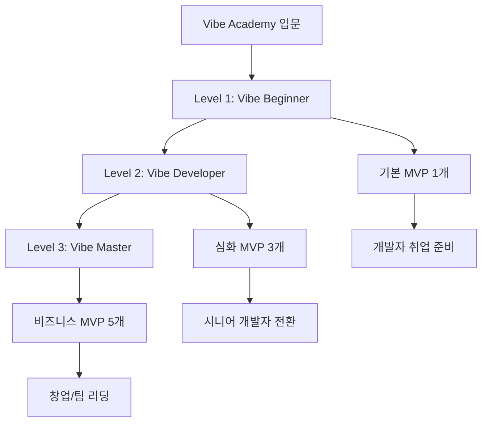
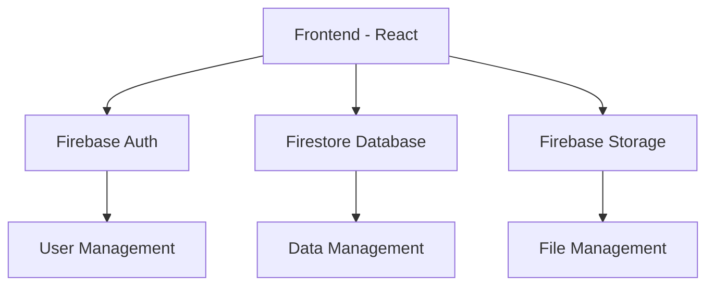

# 🏆 Vibe Academy 평가 및 인증 시스템

**체계적인 3단계 인증 프로그램과 포트폴리오 기반 평가 시스템**

---

## 📋 목차

1. [인증 시스템 개요](#1-인증-시스템-개요)
2. [Level 1: Vibe Beginner](#2-level-1-vibe-beginner)
3. [Level 2: Vibe Developer](#3-level-2-vibe-developer)  
4. [Level 3: Vibe Master](#4-level-3-vibe-master)
5. [평가 방법론](#5-평가-방법론)
6. [포트폴리오 요구사항](#6-포트폴리오-요구사항)
7. [인증서 발급 시스템](#7-인증서-발급-시스템)

---

## 🎯 1. 인증 시스템 개요

### 🌟 Vibe Academy 인증 철학

> **"만들어서 증명하라"** - 실제 작동하는 서비스로 실력을 입증하는 실무 중심 인증

### 📊 3단계 인증 체계



### 🎪 인증 혜택

| Level | 인증서 | 포트폴리오 | 취업 지원 | 네트워킹 | 특별 혜택 |
|-------|---------|------------|----------|----------|-----------|
| **Level 1** | 디지털 인증서 | 기본 MVP 1개 | 이력서 리뷰 | 동기 그룹 | - |
| **Level 2** | 디지털 + 실물 | 심화 MVP 3개 | 모의 면접 | 멘토 연결 | 유료 강의 50% 할인 |
| **Level 3** | 프리미엄 인증서 | 비즈니스 MVP 5개 | 회사 추천 | 마스터 네트워크 | 강의 제작 기회 |

---

## 🌱 2. Level 1: Vibe Beginner

### 🎯 목표
**"AI와 함께 첫 번째 웹 서비스를 만들어 배포까지 완성한다"**

### 📚 학습 범위
- **기간**: 4주 (주 10시간)
- **교재**: 1-3권 (기초편, 실전편, 배포편)
- **핵심 기술**: HTML, CSS, JavaScript 기초 + React 입문

### 🔍 평가 기준

#### 필수 요구사항 (80점)
1. **기본 기능 구현** (30점)
   - [ ] React 컴포넌트 기반 UI 구현
   - [ ] State 관리를 통한 동적 기능
   - [ ] 최소 3개 페이지 구성

2. **Firebase 연동** (25점)
   - [ ] Firebase Authentication 로그인 구현
   - [ ] Firestore 데이터 읽기/쓰기
   - [ ] 사용자별 데이터 구분 관리

3. **배포 및 접근성** (25점)
   - [ ] Vercel 배포 완료
   - [ ] 실제 도메인으로 접근 가능
   - [ ] 모바일 반응형 디자인

#### 추가 점수 (20점)
1. **코드 품질** (10점)
   - [ ] 깔끔한 컴포넌트 구조
   - [ ] 적절한 파일 분리
   - [ ] 기본적인 에러 처리

2. **사용자 경험** (10점)
   - [ ] 직관적인 UI/UX
   - [ ] 로딩 상태 표시
   - [ ] 기본적인 스타일링

### 📋 제출 포트폴리오

#### 1. 프로젝트 결과물
```markdown
# Level 1 포트폴리오 체크리스트

## 📱 프로젝트 정보
- **프로젝트명**: [예: 나만의 독서 기록 앱]
- **배포 URL**: https://my-project.vercel.app
- **GitHub**: https://github.com/username/project
- **개발 기간**: 4주
- **사용 기술**: React, Firebase, Vercel, TailwindCSS

## 🎯 핵심 기능
1. 사용자 로그인/회원가입 (Firebase Auth)
2. 데이터 CRUD 기능 (Firestore)
3. 반응형 웹 디자인
4. [추가 기능 1]
5. [추가 기능 2]

## 📸 스크린샷
- 메인 페이지 스크린샷
- 로그인 페이지 스크린샷  
- 주요 기능 스크린샷 (3개)

## 🚀 배포 및 접근
- [ ] 배포 URL 정상 작동
- [ ] 모바일에서 정상 작동
- [ ] 로그인 기능 정상 작동
```

#### 2. 학습 성찰 보고서 (1-2페이지)
```markdown
# Level 1 학습 성찰 보고서

## 💪 성취한 것들
- React의 기본 개념(컴포넌트, State, Props) 이해
- Firebase를 통한 실시간 데이터베이스 경험
- 실제 서비스 배포 경험

## 🎓 배운 핵심 개념들
1. **React**: [구체적으로 배운 내용]
2. **Firebase**: [구체적으로 배운 내용]
3. **배포**: [구체적으로 배운 내용]

## 🚧 어려웠던 점과 해결 과정
1. **문제**: [구체적인 문제]
   **해결**: [해결 과정과 방법]

2. **문제**: [구체적인 문제]  
   **해결**: [해결 과정과 방법]

## 🔮 다음 목표
Level 2에서 도전하고 싶은 프로젝트와 학습 목표
```

### ✅ 인증 절차

1. **온라인 제출** (80% 완료시)
   - GitHub 저장소 URL 제출
   - 배포 URL 제출
   - 학습 성찰 보고서 제출

2. **동료 리뷰** (1주)
   - 같은 Level 1 수강생끼리 서로 프로젝트 리뷰
   - 피드백 주고받기

3. **멘토 검토** (1주)
   - Vibe Academy 멘토의 최종 검토
   - 개선 사항 피드백

4. **인증서 발급**
   - 디지털 인증서 + LinkedIn 게시 가능한 배지

---

## 🚀 3. Level 2: Vibe Developer

### 🎯 목표
**"복잡한 비즈니스 로직을 가진 실용적인 서비스 3개를 개발하고 운영한다"**

### 📚 학습 범위
- **기간**: 8주 (주 15시간)
- **교재**: 1-5권 (기초편~팀워크편)
- **핵심 기술**: 고급 React, 상태 관리, API 연동, 팀 협업

### 🔍 평가 기준

#### 필수 요구사항 (80점)

1. **프로젝트 1: 개인 서비스** (25점)
   - [ ] 고급 React 패턴 사용 (Context, Custom Hooks)
   - [ ] 외부 API 연동 (최소 2개)
   - [ ] 복잡한 상태 관리 (Redux 또는 Zustand)
   - [ ] 테스트 코드 작성 (기본 수준)

2. **프로젝트 2: 협업 프로젝트** (25점)
   - [ ] 2-3명 팀 프로젝트
   - [ ] Git 브랜치 전략 적용
   - [ ] 코드 리뷰 프로세스
   - [ ] 역할 분담 및 프로젝트 관리

3. **프로젝트 3: 비즈니스 중심 MVP** (30점)
   - [ ] 실제 사용자 문제 해결
   - [ ] 수익 모델 설계
   - [ ] 사용자 피드백 수집 및 반영
   - [ ] 데이터 분석 및 개선

#### 추가 점수 (20점)

1. **기술적 깊이** (10점)
   - [ ] 성능 최적화 적용
   - [ ] 접근성(a11y) 고려
   - [ ] SEO 최적화
   - [ ] PWA 기능 구현

2. **비즈니스 인사이트** (10점)
   - [ ] 사용자 데이터 분석
   - [ ] A/B 테스트 실행
   - [ ] 수익 창출 시도
   - [ ] 마케팅 활동 경험

### 📋 제출 포트폴리오

#### 1. 3개 프로젝트 상세 문서
```markdown
# Level 2 포트폴리오

## 📱 프로젝트 1: [개인 서비스명]
### 🎯 프로젝트 개요
- **문제 정의**: 해결하고자 한 실제 문제
- **솔루션**: 개발한 해결책
- **사용자**: 타겟 사용자 그룹

### 🛠 기술적 구현
- **핵심 기술 스택**: React, TypeScript, Firebase, Vercel
- **아키텍처**: 시스템 구조도
- **주요 기능**: 핵심 기능 3-5개 설명
- **도전적인 구현**: 기술적으로 어려웠던 부분과 해결책

### 📊 성과 측정
- **사용자 수**: 실제 사용자 수 (최소 10명)
- **사용 패턴**: 사용자 행동 분석
- **피드백**: 수집한 사용자 피드백과 개선사항

## 📱 프로젝트 2: [협업 프로젝트명]
### 👥 팀 구성 및 역할
- **팀원**: 각 팀원 역할과 기여도
- **협업 도구**: 사용한 도구들 (GitHub, Figma, Notion 등)
- **프로세스**: 적용한 개발 프로세스

### 🔄 협업 경험
- **브랜치 전략**: 적용한 Git 전략
- **코드 리뷰**: 리뷰 과정과 배운 점
- **갈등 해결**: 팀 내 문제와 해결 과정

## 📱 프로젝트 3: [비즈니스 MVP명]
### 💰 비즈니스 모델
- **수익 구조**: 설계한 수익 모델
- **시장 분석**: 경쟁사 분석 및 차별점
- **성장 전략**: 사용자 확보 계획

### 📈 실제 운영 결과
- **런칭 과정**: 서비스 출시 과정
- **사용자 반응**: 실제 사용자 피드백
- **개선 사항**: 운영하며 개선한 점들
```

#### 2. 기술 블로그 포스팅 (3개)
- 각 프로젝트별 기술적 도전과 해결 과정을 블로그 포스팅
- Medium, 브런치, 개인 블로그 등에 게시
- 동료 및 커뮤니티 피드백 수집

#### 3. 발표 자료 (15분 발표)
- 3개 프로젝트 핵심 내용 요약
- 학습 성장 과정 공유
- Q&A 준비

### ✅ 인증 절차

1. **포트폴리오 제출** (Level 2 완료시)
2. **동료 프로젝트 리뷰** (2주) - 서로의 프로젝트 깊이 있게 리뷰
3. **발표 및 질의응답** (1일) - 온/오프라인 발표회
4. **멘토 패널 평가** (1주) - 업계 전문가 평가
5. **인증서 발급** - 디지털 + 실물 인증서

---

## 🏆 4. Level 3: Vibe Master

### 🎯 목표
**"비즈니스를 이해하고 팀을 이끌며 실제 수익을 창출하는 서비스를 만든다"**

### 📚 학습 범위
- **기간**: 12주 (주 20시간)
- **교재**: 전 권 (1-7권) + 심화 학습
- **핵심 역량**: 리더십, 비즈니스 전략, 팀 관리, 수익 창출

### 🔍 평가 기준

#### 필수 요구사항 (80점)

1. **마스터 프로젝트** (40점)
   - [ ] 실제 수익 창출 (최소 월 10만원)
   - [ ] 50명 이상 실사용자 확보
   - [ ] 3개월 이상 지속 운영
   - [ ] 데이터 기반 의사결정 증명

2. **팀 리더십** (20점)
   - [ ] 3명 이상 팀 구성 및 리딩
   - [ ] 프로젝트 관리 및 일정 관리
   - [ ] 팀원 코드 리뷰 및 멘토링
   - [ ] 갈등 해결 및 의사결정 경험

3. **기술적 우수성** (20점)
   - [ ] 확장 가능한 아키텍처 설계
   - [ ] 성능 최적화 및 모니터링
   - [ ] 자동화 및 CI/CD 구축
   - [ ] 보안 및 데이터 처리 고려

#### 추가 점수 (20점)

1. **사회적 영향** (10점)
   - [ ] 실제 사회 문제 해결
   - [ ] 사용자 만족도 높은 서비스
   - [ ] 커뮤니티 기여 활동
   - [ ] 오픈소스 기여

2. **지식 전파** (10점)
   - [ ] 강의 또는 워크샵 진행
   - [ ] 기술 아티클 작성 (10개 이상)
   - [ ] 컨퍼런스 발표 경험
   - [ ] 멘토링 활동

### 📋 제출 포트폴리오

#### 1. 마스터 프로젝트 종합 보고서
```markdown
# Level 3 마스터 포트폴리오

## 🚀 프로젝트 개요
### 비즈니스 임팩트
- **수익 창출**: [구체적 수익 데이터]
- **사용자 규모**: [MAU, DAU 등 구체적 지표]
- **시장 반응**: [언론 보도, 사용자 후기 등]

### 기술적 성취
- **아키텍처**: [확장 가능한 시스템 설계]
- **성능**: [구체적 성능 지표 및 최적화 결과]
- **안정성**: [에러율, 업타임 등]

## 👥 팀 리더십 경험
### 팀 구성 및 관리
- **팀 구성**: [각 팀원 역할과 성장]
- **프로세스**: [적용한 개발/관리 프로세스]
- **성과**: [팀 전체 성과와 개인별 성장]

### 리더십 에피소드
- **도전 상황**: [리더로서 겪은 어려움]
- **해결 과정**: [문제 해결 과정]
- **배운 점**: [리더십 관련 인사이트]

## 📊 비즈니스 성과
### 수익 모델 실행
- **계획**: [초기 수익 모델 계획]
- **실행**: [실제 실행 과정]
- **결과**: [구체적 수익 데이터]
- **학습**: [비즈니스적 인사이트]

### 사용자 성장
- **획득**: [사용자 획득 전략과 결과]
- **유지**: [사용자 리텐션 전략]
- **확장**: [서비스 확장 과정]
```

#### 2. 기술 아카이브
- **오픈소스 라이브러리**: 개발하여 공개한 라이브러리
- **기술 블로그**: 10개 이상의 심화 기술 아티클
- **코드 리뷰**: 다른 개발자들의 코드 리뷰 기여
- **컨퍼런스 발표**: 기술 컨퍼런스 발표 자료

#### 3. 멘토링 포트폴리오
- **멘티 성과**: 멘토링한 개발자들의 성장 사례
- **교육 콘텐츠**: 제작한 교육 자료나 강의
- **커뮤니티 기여**: 개발 커뮤니티에서의 활동

### ✅ 인증 절차

1. **프로젝트 심사** (4주)
   - 실제 서비스 운영 상태 확인
   - 수익 데이터 검증
   - 사용자 인터뷰 진행

2. **기술 심화 평가** (2주)
   - 시니어 개발자 패널 코드 리뷰
   - 아키텍처 설계 발표
   - 기술적 의사결정 과정 평가

3. **리더십 평가** (2주)
   - 팀원들의 360도 피드백
   - 프로젝트 관리 능력 평가
   - 갈등 해결 사례 검토

4. **최종 발표** (1일)
   - 30분 종합 발표
   - 업계 전문가 패널 질의응답
   - 동료 마스터들과의 토론

5. **마스터 인증서 발급**
   - 프리미엄 디지털 + 실물 인증서
   - Vibe Academy 마스터 네트워크 가입
   - 강의 및 멘토링 기회 제공

---

## 📊 5. 평가 방법론

### 🎯 평가 철학

> **"완벽한 코드보다 작동하는 서비스, 이론보다 실제 사용자 반응"**

### 📏 평가 기준 체계

#### 1. 기술적 구현 (40%)
```markdown
### 코드 품질 평가 기준

#### 우수 (90-100점)
- 컴포넌트 재사용성이 높고 모듈화가 잘 되어 있음
- 에러 처리와 예외 상황 대응이 철저함
- 성능 최적화가 적절히 적용됨
- 테스트 코드가 핵심 기능을 잘 커버함

#### 보통 (70-89점)  
- 기본적인 기능이 정상 작동함
- 코드 구조가 이해하기 어렵지 않음
- 간단한 에러 처리가 되어 있음
- 기본적인 최적화가 적용됨

#### 개선 필요 (50-69점)
- 기능은 작동하지만 코드가 복잡하거나 중복이 많음
- 에러 처리가 부족함
- 성능 이슈가 있음

#### 미달 (50점 미만)
- 핵심 기능이 정상 작동하지 않음
- 코드 구조를 이해하기 어려움
```

#### 2. 사용자 경험 (30%)
```markdown
### UX 평가 기준

#### 실제 사용자 테스트
- 최소 10명의 실제 사용자 테스트
- 사용자 여정(User Journey) 완주율
- 사용자 만족도 설문조사
- 재사용 의향 조사

#### UI/UX 디자인
- 직관적인 인터페이스 설계
- 모바일 친화적 반응형 디자인
- 접근성(Accessibility) 고려
- 로딩 상태 및 피드백 제공
```

#### 3. 비즈니스 가치 (20%)
```markdown
### 비즈니스 임팩트 평가

#### Level 1: 문제 해결
- 실제 존재하는 문제를 해결하는가?
- 타겟 사용자가 명확한가?

#### Level 2: 시장 적합성
- 경쟁사 대비 차별점이 있는가?
- 사용자 획득 전략이 현실적인가?

#### Level 3: 수익 창출
- 실제 수익이 발생하는가?
- 지속 가능한 비즈니스 모델인가?
```

#### 4. 학습 및 성장 (10%)
```markdown
### 성장 지표

#### 학습 태도
- 새로운 기술 습득 의지
- 피드백 수용 및 개선 노력
- 지속적인 자기계발

#### 커뮤니티 기여
- 동료 학습자 도움
- 지식 공유 활동
- 오픈소스 기여
```

### 📊 평가 도구 및 방법

#### 1. 자동화된 코드 평가
```javascript
// 코드 품질 자동 평가 도구
const codeQuality = {
  linting: 'ESLint 통과 여부',
  testing: '테스트 커버리지 (최소 60%)',
  performance: 'Lighthouse 점수 (최소 80점)',
  security: '보안 취약점 스캔 결과'
};
```

#### 2. 사용자 피드백 수집
```markdown
### 사용자 평가 설문지 템플릿

1. 이 서비스를 사용하기 쉬웠나요? (1-5점)
2. 서비스가 해결하려는 문제가 명확했나요? (1-5점)
3. 다시 이용하고 싶나요? (1-5점)
4. 다른 사람에게 추천하시겠나요? (1-5점)
5. 가장 좋았던 점은 무엇인가요? (주관식)
6. 개선이 필요한 점은 무엇인가요? (주관식)
```

#### 3. 동료 평가 (Peer Review)
```markdown
### 동료 평가 기준

#### 코드 리뷰 관점
- 코드 가독성과 유지보수성
- 아키텍처 설계의 합리성
- 기술 선택의 적절성

#### 프로젝트 관점
- 프로젝트 완성도
- 창의성과 혁신성
- 실용성과 유용성

#### 발표 및 소통 관점
- 프로젝트 설명 능력
- 질문에 대한 답변 품질
- 피드백 수용 태도
```

---

## 💼 6. 포트폴리오 요구사항

### 📁 포트폴리오 구조

#### Level 1: 기본 포트폴리오
```
📁 vibe-portfolio-level1/
├── 📄 README.md (프로젝트 개요)
├── 📱 project/ (실제 프로젝트 코드)
├── 📸 screenshots/ (스크린샷 모음)
├── 📝 reflection.md (학습 성찰)
└── 🔗 links.md (배포 URL, GitHub 등)
```

#### Level 2: 전문 포트폴리오
```
📁 vibe-portfolio-level2/
├── 📄 README.md (포트폴리오 전체 개요)
├── 📁 project1-personal/ 
│   ├── 📱 code/
│   ├── 📊 analytics/
│   └── 📝 case-study.md
├── 📁 project2-team/
│   ├── 📱 code/
│   ├── 👥 team-docs/
│   └── 📝 collaboration.md
├── 📁 project3-business/
│   ├── 📱 code/
│   ├── 💰 business-plan/
│   └── 📈 metrics.md
├── ✍️ blog-posts/ (기술 블로그 포스팅)
└── 🎥 presentations/ (발표 자료)
```

#### Level 3: 마스터 포트폴리오
```
📁 vibe-portfolio-master/
├── 📄 README.md (마스터 포트폴리오 소개)
├── 🚀 master-project/
│   ├── 📱 production-code/
│   ├── 📊 business-metrics/
│   ├── 👥 team-management/
│   └── 📈 growth-analytics/
├── 🏗 technical-contributions/
│   ├── 📦 open-source/
│   ├── 📚 libraries/
│   └── 🔧 tools/
├── 👨‍🏫 mentoring-portfolio/
│   ├── 📖 educational-content/
│   ├── 👥 mentoring-cases/
│   └── 🎤 speaking-engagements/
└── 🌟 community-impact/
    ├── 📝 articles/
    ├── 🏆 awards/
    └── 📺 media-coverage/
```

### 📋 포트폴리오 작성 가이드

#### 1. README.md 작성법
```markdown
# [이름]의 Vibe Academy 포트폴리오

## 👋 소개
안녕하세요! AI와 함께 웹 개발을 배우고 있는 [이름]입니다.

## 🎯 목표
- [구체적인 커리어 목표]
- [습득하고 싶은 기술]
- [만들고 싶은 서비스]

## 🚀 프로젝트

### 📱 [프로젝트명]
- **기간**: 2024.01 - 2024.02 (4주)
- **역할**: Full-stack Developer
- **기술**: React, Firebase, Vercel
- **링크**: [배포 URL] | [GitHub]
- **설명**: [1-2줄 프로젝트 설명]

### 핵심 성과
- ✅ [구체적 성과 1]
- ✅ [구체적 성과 2]
- ✅ [구체적 성과 3]

## 🛠 기술 스택
### Frontend
- React, JavaScript/TypeScript
- TailwindCSS, HTML/CSS

### Backend & Database  
- Firebase (Auth, Firestore, Storage)
- RESTful API

### DevOps
- Git/GitHub, Vercel
- CI/CD Pipeline

## 📈 성장 지표
- **완성 프로젝트**: [개수]개
- **GitHub 커밋**: [개수]개 (일평균 [개수]개)
- **학습 시간**: 총 [시간]시간
- **사용자 피드백**: [점수]/5점 (평균)

## 📞 연락처
- **이메일**: your.email@example.com
- **GitHub**: github.com/username
- **LinkedIn**: linkedin.com/in/username
- **블로그**: blog-url.com
```

#### 2. 프로젝트 케이스 스터디 작성법
```markdown
# [프로젝트명] 케이스 스터디

## 🎯 프로젝트 개요

### 문제 정의
- **배경**: [어떤 문제를 발견했는지]
- **타겟**: [누구를 위한 서비스인지]
- **가설**: [어떤 해결책이 효과적일 것이라 가정했는지]

### 솔루션
- **핵심 기능**: [만든 주요 기능들]
- **차별점**: [기존 서비스와의 차이점]
- **기대 효과**: [기대했던 결과]

## 🛠 기술적 구현

### 아키텍처 설계


### 주요 기능 구현
#### 1. [기능명]
```javascript
// 핵심 코드 스니펫
const handleFeature = async () => {
  // 구현 내용
};
```
**구현 포인트**: [기술적 고려사항]
**어려웠던 점**: [구현 시 어려움]
**해결 방법**: [해결 과정]

## 📊 결과 및 성과

### 정량적 성과
- **사용자 수**: [구체적 숫자]명
- **사용률**: 주간 활성 사용자 [숫자]명
- **만족도**: [점수]/5점
- **완료율**: [퍼센트]%

### 정성적 성과
- **사용자 피드백**: "[실제 사용자 후기]"
- **배운 점**: [기술적/비즈니스적 학습]
- **아쉬운 점**: [개선하고 싶은 부분]

## 🔮 향후 계획
- **단기**: [1개월 내 개선 계획]
- **중기**: [3개월 내 확장 계획]
- **장기**: [1년 내 발전 방향]
```

### 📊 포트폴리오 평가 기준

#### 완성도 (40%)
- [ ] 모든 링크가 정상 작동
- [ ] 스크린샷이 선명하고 적절
- [ ] 문서가 체계적으로 정리됨
- [ ] 프로젝트 코드가 정상 실행됨

#### 내용의 깊이 (30%)
- [ ] 기술적 도전과 해결 과정이 구체적
- [ ] 사용자 피드백이 실제로 수집됨
- [ ] 개선 과정이 명확히 기록됨
- [ ] 학습 과정의 성찰이 진솔함

#### 프레젠테이션 (20%)
- [ ] 가독성이 좋음 (적절한 구조, 이미지)
- [ ] 전문성이 느껴짐
- [ ] 개성과 열정이 드러남
- [ ] 실제 사용자 관점에서 설명

#### 성장 가능성 (10%)
- [ ] 지속적인 개선 의지
- [ ] 새로운 도전에 대한 계획
- [ ] 커뮤니티 기여 의지
- [ ] 장기적인 비전

---

## 🏅 7. 인증서 발급 시스템

### 💎 인증서 디자인 및 내용

#### Level 1: Vibe Beginner 인증서
```
╔══════════════════════════════════════════╗
║            VIBE ACADEMY                  ║
║         Certificate of Achievement       ║
║                                          ║
║  This certifies that                     ║
║          [학습자 이름]                    ║
║                                          ║
║  has successfully completed              ║
║        VIBE BEGINNER PROGRAM             ║
║                                          ║
║  and demonstrated proficiency in:        ║
║  • React Frontend Development           ║
║  • Firebase Backend Integration         ║
║  • Web Application Deployment           ║
║                                          ║
║  Project: [프로젝트명]                   ║
║  Completion Date: [날짜]                 ║
║                                          ║
║  [디지털 서명]    [QR 코드 - 검증용]     ║
╚══════════════════════════════════════════╝
```

#### Level 2: Vibe Developer 인증서
```
╔══════════════════════════════════════════╗
║            VIBE ACADEMY                  ║
║      ADVANCED DEVELOPER CERTIFICATE     ║
║                                          ║
║            [학습자 이름]                  ║
║                                          ║
║   Successfully completed 3 projects:     ║
║   • Personal Service Development        ║
║   • Team Collaboration Project          ║  
║   • Business-focused MVP                ║
║                                          ║
║   Advanced Skills Demonstrated:         ║
║   ✓ Complex State Management           ║
║   ✓ API Integration & Data Handling    ║
║   ✓ Team Leadership & Code Review      ║
║   ✓ User-centered Design Thinking      ║
║                                          ║
║   Portfolio Score: [점수]/100           ║
║   Issued: [날짜]                        ║
║                                          ║
║   [디지털 서명]    [검증 URL]           ║
╚══════════════════════════════════════════╝
```

#### Level 3: Vibe Master 인증서 (프리미엄)
```
╔══════════════════════════════════════════╗
║  ★ ★ ★  VIBE ACADEMY MASTER  ★ ★ ★      ║
║                                          ║
║            [학습자 이름]                  ║
║                                          ║
║    Has achieved MASTER level by:         ║
║                                          ║
║  🏆 Building profitable service          ║
║     Revenue: [수익 금액]                 ║
║     Users: [사용자 수]+ active users     ║
║                                          ║
║  👥 Leading development team             ║
║     Team size: [팀원 수] developers      ║
║     Project duration: [기간]             ║
║                                          ║
║  🚀 Demonstrating technical excellence   ║
║     Architecture design & optimization   ║
║     Scalable system implementation       ║
║                                          ║
║  🌟 Contributing to community            ║
║     [기여 활동 요약]                     ║
║                                          ║
║  Master Project: [프로젝트명]            ║
║  Certified: [날짜]                       ║
║  Valid: Lifetime                         ║
║                                          ║
║  [마스터 서명] [아카데미 서명] [QR코드]   ║
╚══════════════════════════════════════════╝
```

### 🔐 인증서 검증 시스템

#### 1. 블록체인 기반 검증
```javascript
// 인증서 검증 시스템 예시
const certificateVerification = {
  id: "VIBE-2024-DEV-001234",
  holder: "김개발",
  level: "Vibe Developer", 
  issueDate: "2024-03-15",
  blockchain: {
    network: "Polygon",
    contractAddress: "0x...",
    tokenId: "1234",
    hash: "0x..."
  },
  verification: {
    url: "https://verify.vibeacademy.com/cert/001234",
    qrCode: "QR_CODE_DATA",
    status: "verified"
  }
};
```

#### 2. 공개 검증 페이지
```markdown
# 인증서 검증 페이지 (verify.vibeacademy.com)

## 인증서 검증

### 인증서 ID 입력
[입력 필드: VIBE-2024-DEV-001234]
[검증 버튼]

### 검증 결과
✅ **유효한 인증서입니다**

**인증자 정보**
- 이름: 김개발
- 레벨: Vibe Developer
- 발급일: 2024.03.15
- 상태: 유효

**프로젝트 정보**
- 프로젝트 1: [프로젝트명] - [GitHub 링크]
- 프로젝트 2: [프로젝트명] - [배포 URL]
- 프로젝트 3: [프로젝트명] - [데모 링크]

**평가 점수**
- 기술 구현: 85/100
- 사용자 경험: 90/100
- 비즈니스 가치: 80/100
- 종합 점수: 85/100
```

### 📱 디지털 배지 시스템

#### LinkedIn 연동 배지
```json
{
  "name": "Vibe Academy Developer",
  "description": "Successfully completed advanced web development program with React, Firebase, and team collaboration skills",
  "image": "https://cdn.vibeacademy.com/badges/vibe-developer.png",
  "criteria": "https://vibeacademy.com/certification/developer-criteria",
  "issuer": {
    "name": "Vibe Academy",
    "url": "https://vibeacademy.com",
    "email": "certificates@vibeacademy.com"
  },
  "badge": {
    "type": "Assertion",
    "recipient": "kim.developer@email.com",
    "verify": {
      "type": "hosted",
      "url": "https://verify.vibeacademy.com/cert/001234"
    }
  }
}
```

### 🏆 인증서 활용 가이드

#### 이력서 작성 가이드
```markdown
## 인증서를 활용한 이력서 작성법

### 📋 학력/자격증 섹션
**Vibe Academy Master Certificate** (2024.06)
- 실무 중심 웹 개발 마스터 과정 수료
- 실제 수익 창출 서비스 개발 ([프로젝트명], 월 50만원 수익)
- 3명 개발팀 리딩 및 프로젝트 관리 경험
- 검증 URL: verify.vibeacademy.com/cert/001234

### 📱 프로젝트 경험 섹션
**[프로젝트명] - Vibe Academy Master Project** (2024.03 - 2024.06)
- **역할**: Team Lead & Full-stack Developer
- **기술**: React, TypeScript, Firebase, Vercel
- **성과**: 실사용자 100명+, 월 수익 50만원 달성
- **링크**: [배포 URL] | [GitHub]

### 💪 핵심 역량 섹션
- **프론트엔드**: React, TypeScript, TailwindCSS
- **백엔드**: Firebase, REST API, Database Design
- **협업**: Git/GitHub, Code Review, Agile
- **리더십**: 팀 관리, 프로젝트 기획, 갈등 해결
```

#### 면접 준비 가이드
```markdown
## 인증서 관련 예상 질문 & 답변

### Q: "Vibe Academy는 어떤 교육과정인가요?"
A: "AI 도구를 활용하여 실제 작동하는 웹 서비스를 만드는 실무 중심 교육과정입니다. 
이론보다는 실제 프로젝트를 통해 배우며, 실사용자의 피드백을 받아 개선하는 과정을 반복합니다."

### Q: "어떤 프로젝트를 만들었나요?"
A: "[구체적 프로젝트 설명]
실제로 [사용자 수]명이 사용하고 있으며, [구체적 피드백]과 같은 반응을 받았습니다."

### Q: "팀 리더 경험을 구체적으로 설명해주세요."
A: "[구체적 리더십 경험 설명]
특히 [갈등 상황]에서 [해결 과정]을 통해 팀을 이끌었습니다."
```

---

## 🎊 마무리

### 🌟 Vibe Academy 인증의 가치

> **"인증서는 시작일 뿐, 진짜 가치는 만들어낸 서비스와 성장한 실력입니다."**

### 📈 지속적인 성장 시스템

#### 인증 후 지원 프로그램
- **마스터 네트워크**: 동기들과의 지속적인 교류
- **멘토링 기회**: 후배 개발자들 멘토링 참여
- **고급 과정**: 새로운 기술 스택 학습 기회
- **취업 지원**: 파트너사 채용 연계 프로그램

#### 평생 학습 커뮤니티
- **기술 공유**: 새로운 기술 트렌드 공유
- **프로젝트 협업**: 인증자들 간 협업 프로젝트
- **성공 사례**: 졸업생 성공 스토리 공유
- **업계 네트워킹**: 현업 개발자들과의 만남

### 🚀 다음 단계

인증 완료 후에도 계속 성장할 수 있도록:

1. **기술 블로그 지속 운영**
2. **오픈소스 프로젝트 기여**
3. **컨퍼런스 발표 도전**
4. **창업 또는 팀 합류**
5. **후배 개발자 멘토링**

---

**🎯 기억하세요**: 인증서는 여러분의 실력을 증명하는 도구일 뿐입니다. 
진짜 중요한 것은 사용자에게 가치를 제공하는 서비스를 만들 수 있는 능력입니다!